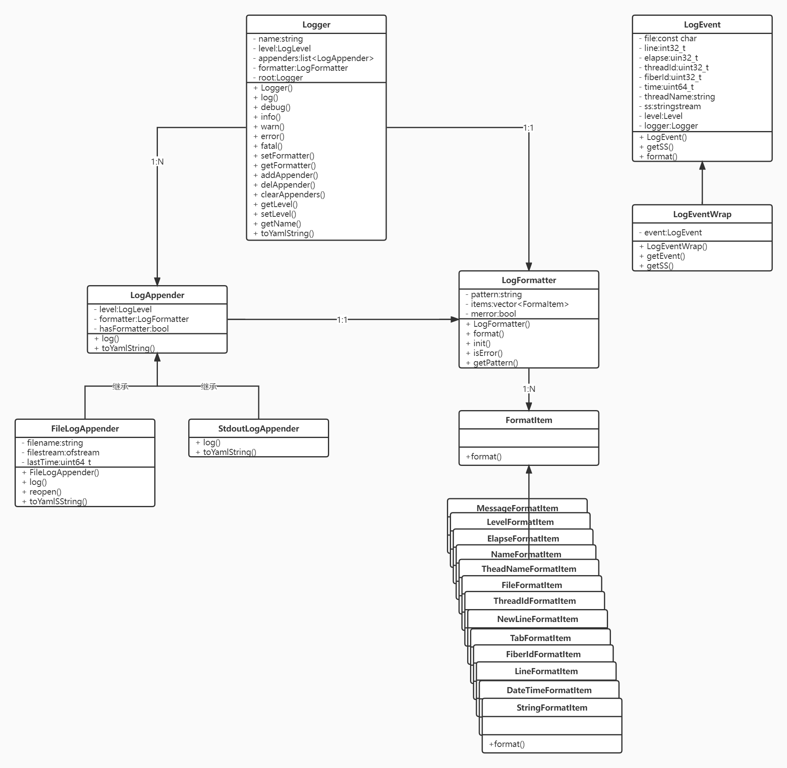

# 数据中心
用于存放数据，提供数据的上传和下载功能，使用MySQL数据库存储

## 日志模块
用于格式化输出程序日志，方便从日志中定位程序运行过程中出现的问题。这里的日志除了日志内容本身之外，还应该包括文件名/行号，时间戳，线程/协程号，模块名称，日志级别等额外信息，甚至在打印致命的日志时，还应该附加程序的栈回溯信息，以便于分析和排查问题。

### 关键实现
#### LogEvent
日志事件，用于记录日志现场，具体包括以下内容：  
+ 日志内容
+ 日志器名称
+ 日志级别
+ 文件名
+ 行号
+ 程序运行时间
+ 线程ID
+ 时间戳
+ 线程名称
#### LogFormatter
日志格式器，用于格式化一个日志事件，将其转化成一串字符串。LogFormatter使用模板字符串来指定格式化的方式，可按照需要自行设置：
```C++
"%d{%Y-%m-%d %H:%M:%S}%T%t%T%N%T%F%T[%p]%T[%c]%T%f:%l%T%m%n"
```
LogFormatter根据模板字符串来格式化日志事件。首先，在构造LogFormatter对象时会指定一串模板字符，LogFormatter会首先解析该模板字符串，将其中的转义字符和普通字符解析出来。然后，在格式化日志事件时，根据模板字符串，将其中的转义字符替换成日志事件的具体内容，普通字符保持不变。

当前实现支持以下转义字符：
```C++
%m 消息
%p 日志级别
%c 日志器名称
%d 日期时间，后面可跟一对括号指定时间格式，比如%d{%Y-%m-%d %H:%M:%S}
%f 文件名
%l 行号
%t 线程id
%N 线程名称
%% 百分号
%T 制表符
%n 换行
```
#### LogAppender
日志输出器，用于输出一个日志事件。这是一个虚类，可以派生出不同的具体实现，比如往输出到终端的StdoutLogAppender，以及输出到文件的FileLogAppender。

LogAppender的实现包含了一个用户指定的LogFormatter和一个默认的LogFormatter，以及log方法，不同类型的Appender通过重载log方法来实现往不同的目的地进行输出

### 待完善
+ [ ] 程序运行时间
+ [ ] 多线程安全支持
+ [ ] 日志文件按大小分片或是按日期分片

## 文件传输模块
文件传输使用TCP和FTP两种协议实现，文件采用增量式传输，并采用异步通讯模式。

## 数据库连接模块

## 数据抽取模块
从源数据库中抽取数据，生成xml文件

### 需实现效果
+ [x] 支持xml格式文件
+ [x] 限制单个文件数据条数
+ [x] 通用工具，能够针对任意数据表
+ [ ] 支持选择存储为单个文件和多个文件
+ [ ] 支持增量抽取(自增字段保存在文件中)
+ [ ] 支持增量抽取(自增字段保存在数据库中)


## 数据入库模块